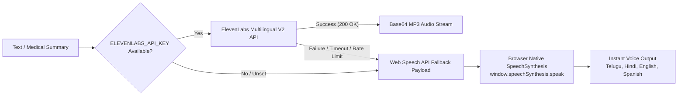
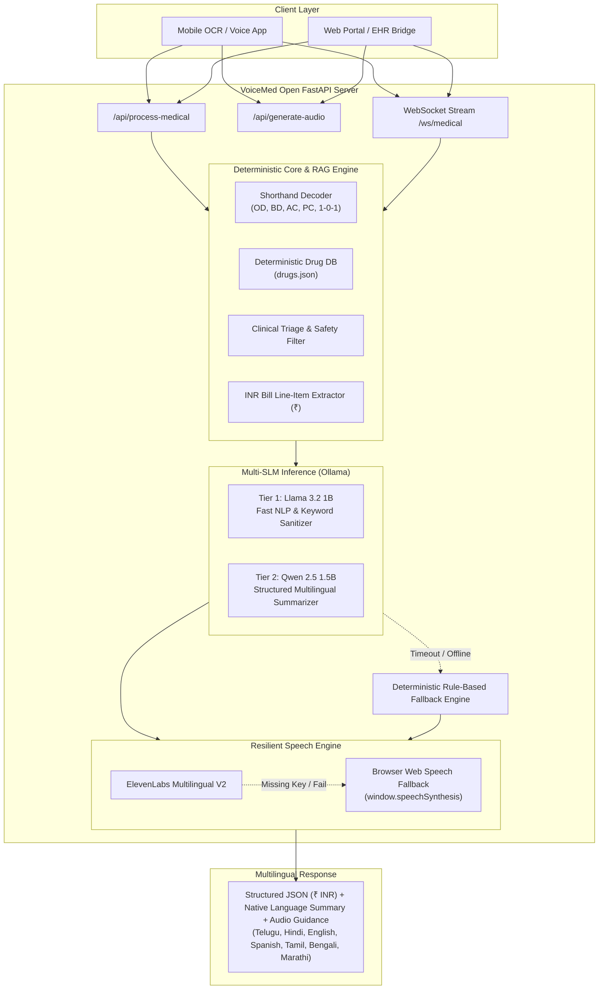

# 🩺 VoiceMed Open — Open-Source Multilingual Healthcare AI Assistant

[](LICENSE)
[](https://fastapi.tiangolo.com)
[](https://www.python.org/)
[](https://ollama.com/)
[-orange.svg)](#currency-localization-inr-)
[](#resilient-audio-architecture)

**VoiceMed Open** is a lightweight, privacy-first, multilingual healthcare decision-support assistant. It bridges the critical communication gap between healthcare systems and patients by combining **local Small Language Models (SLMs)**, **deterministic clinical knowledge bases (RAG)**, **Indian Rupee (₹ / INR) hospital bill auditing**, and **resilient multilingual voice generation (ElevenLabs + Web Speech fallback)**.

---

> ### ⚠️ Critical Medical Disclaimer
> **VoiceMed Open** is an open-source educational and clinical decision-support prototype. It is **not** a certified medical device, diagnostic system, or substitute for licensed medical judgment. Never disregard professional clinical advice or delay seeking emergency care based on outputs generated by this system. In medical emergencies in India, immediately call **108** or **112** (or **911** in the US).

---

## 🎯 The Problem Statement

Modern healthcare systems impose severe cognitive and financial burdens on patients due to four systemic breakdowns:

```
┌─────────────────────────────────────────────────────────────────────────────────────────┐
│                           CRITICAL HEALTHCARE SYSTEM DOWNFALLS                          │
├───────────────────────────────┬───────────────────────────────┬─────────────────────────┤
│ 1. Cryptic Prescription       │ 2. Opaque Hospital Billing    │ 3. Intimidating Policy  │
│    Shorthand                  │    & Consumable Markups       │    Jargon & Deductions  │
│ Doctors write in abbreviated  │ Hospital bills contain dense  │ IRDAI policies hide 1%  │
│ Latin codes (OD, BD, AC, PC), │ unbundled line items (₹) with │ room rent caps, leading │
│ causing medication timing     │ non-medical markups that      │ to 50% proportionate    │
│ and dosage errors.            │ patients cannot audit.        │ deductions across bills.│
├───────────────────────────────┴───────────────────────────────┴─────────────────────────┤
│ 4. Delayed Triage & Language Inequity                                                   │
│ Patients in multilingual societies lack accessible preliminary health triage guidance   │
│ in their native tongue (Telugu, Hindi, Tamil, etc.), delaying critical care.            │
└─────────────────────────────────────────────────────────────────────────────────────────┘
```

---

## 🚀 Key Medical Features

### 1. 💊 Prescription Decoding & Drug Safety (`"prescription"`)
- **Medical Shorthand Translation:** Translates physician abbreviations (`OD`, `BD`, `TID`, `QID`, `AC`, `PC`, `HS`, `SOS`, `1-0-1`, `PO`, `PRN`) into plain, actionable instructions.
- **Deterministic Drug RAG:** Cross-references active pharmaceutical ingredients against the local formulary (`drugs.json`) for dosage thresholds, maximum daily limits, and severe drug interactions.
- **Strict Food & Timing Directives:** Explains exact meal timings (e.g. taking PPIs 30–60 min before breakfast, taking NSAIDs after food to prevent gastric ulcers).

### 2. 🧾 Hospital Bill & Cost Breakdown in INR (`"bill_analysis"`)
- **Localized in Indian Rupees (₹ / INR):** Parses hospital bills, invoices, and estimates in Indian Rupees (₹, Rs., INR).
- **Itemized Categorization:** Groups receipts into 6 standardized buckets:
  1. *Room & Nursing Care* (e.g. Deluxe Room ₹10,000/day)
  2. *Doctor & Surgeon Consultation Fees* (e.g. ₹1,500/visit)
  3. *Diagnostic / Laboratory / Imaging* (e.g. CBC ₹800)
  4. *Pharmacy & IV Infusions* (e.g. IV Amox ₹480)
  5. *Operation Theatre & Surgical Procedures* (e.g. OT ₹8,400)
  6. *Non-Medical Consumables & Miscellaneous* (e.g. PPE & Gloves ₹3,250)
- **Consumable Markup Audit:** Flags high-margin disposable items often excluded by standard insurers under Non-Payable riders.
- **Patient Advocacy Guidance:** Provides actionable questions to challenge billing discrepancies against hospital tariff cards and GIPSA/ROHINI rates.

### 3. 🛡️ Health Insurance Clause Simplifier (`"insurance"`)
- **Plain-Language Demystification:** Translates dense legal clauses, pre-existing disease (PED) exclusions, and copayment percentages into understandable terms.
- **Room Rent Cap & Proportionate Deduction Alert:** Explicitly calculates the financial danger of selecting a room tier above policy limits (e.g. a 1% room rent cap breach triggering a 50% proportionate deduction across doctor and surgery fees).
- **TPA Pre-Authorization Checklist:** Step-by-step documentation guide to facilitate cashless claims and prevent rejections.

### 4. 🩺 Pocket Doctor & Preliminary Triage (`"pocket_doctor"`)
- **Urgency Triage Classification:** Categorizes patient queries into `EMERGENCY`, `URGENT`, `ROUTINE`, or `SELF_CARE`.
- **Red-Flag Symptom Detector:** Immediately triggers emergency warnings upon detecting acute chest pain, shortness of breath, neurological deficits, or severe trauma (advising calling 108 / 112 / 911).
- **Doctor Consultation Prep:** Formulates tailored questions for the patient's next clinical visit alongside supportive home comfort measures.

---

## 🎙️ Resilient Audio Architecture (ElevenLabs + Web Speech Fallback)

To guarantee **zero downtime during live hackathon judging and offline field deployments**, VoiceMed Open implements a 2-tier resilient voice synthesis architecture:



- **Tier 1 (High-Fidelity Studio Voice):** If `ELEVENLABS_API_KEY` is configured, synthesizes voice via ElevenLabs Multilingual V2.
- **Tier 2 (Zero-Latency Browser Fallback):** If ElevenLabs is missing, offline, or rate-limited, the backend automatically returns structured BCP-47 speech configuration (`te-IN`, `hi-IN`, `en-IN`, `es-ES`, etc.) enabling the frontend to play native audio through `window.speechSynthesis` with 0ms latency and zero external dependencies.

---

## 🏗️ System Architecture



---

## 💻 Tech Stack

| Component | Technology | Description |
| :--- | :--- | :--- |
| **API Framework** | [FastAPI](https://fastapi.tiangolo.com/) | High-performance async Python backend with automatic OpenAPI docs |
| **ASGI Server** | [Uvicorn](https://www.uvicorn.org/) | Production-ready ASGI server |
| **Data Validation** | [Pydantic v2](https://docs.pydantic.dev/) | Strict typing, schema validation, and serialization |
| **Local SLM Runtime** | [Ollama](https://ollama.com/) | 100% offline, private Small Language Model inference |
| **Default Model** | `qwen2.5:1.5b` / `llama3.2:1b` | Lightweight multilingual instruction-tuned models |
| **Voice Synthesis** | ElevenLabs + Web Speech | Resilient dual-engine audio playback (Telugu, Hindi, English) |
| **Real-time Protocol** | WebSockets | Bidirectional low-latency streaming for live audio/OCR feeds |
| **Knowledge Base** | Versioned JSON RAG (`drugs.json`) | Deterministic clinical drug ground truth |

---

## ⚡ Quickstart & Installation

### Prerequisites

- **Python**: 3.10 or higher
- **OS**: Windows 10/11, macOS, or Linux
- **Ollama**: Download and install from [ollama.com](https://ollama.com/)
- *(Optional)* **ElevenLabs API Key**: Set `ELEVENLABS_API_KEY` in environment for studio TTS.

### 1. Clone the Repository

```bash
git clone https://github.com/flashvenkat/CircuitHealth-AI.git voicemed-open
cd voicemed-open
```

### 2. Pull Recommended Local Models

```bash
ollama pull qwen2.5:1.5b
ollama pull llama3.2:1b
```

### 3. Setup Python Virtual Environment

**On Windows (PowerShell):**
```powershell
python -m venv venv
Set-ExecutionPolicy -Scope Process -ExecutionPolicy RemoteSigned
.\venv\Scripts\Activate.ps1
pip install --upgrade pip
pip install -r requirements.txt
```

**On Linux / macOS:**
```bash
python3 -m venv venv
source venv/bin/activate
pip install --upgrade pip
pip install -r requirements.txt
```

### 4. Start the Server

**Using the Windows launcher:**
```powershell
.\start_server.bat
```

**Or with Uvicorn:**
```bash
uvicorn server:app --reload --host 127.0.0.1 --port 8000
```

The server will be available at:
- **API Base:** `http://127.0.0.1:8000`
- **Interactive Swagger Docs:** `http://127.0.0.1:8000/docs`
- **ReDoc Documentation:** `http://127.0.0.1:8000/redoc`

### 5. Run the Automated Test Client

```bash
python test_client.py
```

---

## 📡 API Reference

### `POST /api/process-medical`

Core unified endpoint for all four medical features.

#### Request Body Schema

```json
{
  "feature": "prescription | bill_analysis | insurance | pocket_doctor",
  "input_text": "string",
  "language": "English | Hindi | Telugu | Spanish | Tamil | Bengali | Marathi",
  "user_context": {
    "age": 45,
    "allergies": ["Sulfa drugs"]
  }
}
```

#### Feature Examples & Payloads

<details>
<summary><b>1. Prescription Decoding Example</b></summary>

**Request:**
```bash
curl -X POST "http://127.0.0.1:8000/api/process-medical" \
     -H "Content-Type: application/json" \
     -d '{
       "feature": "prescription",
       "input_text": "Rx: Tab Augmentin 625mg 1-0-1 PC x 5 days, Cap Pan 40 1-0-0 AC.",
       "language": "English"
     }'
```

**Response (excerpt):**
```json
{
  "feature": "prescription",
  "language": "English",
  "currency": "INR (₹)",
  "structured_data": {
    "matched_drugs": [
      {
        "generic_name": "Amoxicillin + Clavulanic Acid (Co-amoxiclav)",
        "brand_names": ["Augmentin", "Clavam 625"],
        "purpose": "Broad-spectrum antibacterial treatment...",
        "dosage_warning": "Typically 625mg twice daily. Always complete entire course.",
        "food_instructions": "MANDATORY: Take at the start of a meal..."
      }
    ],
    "decoded_shorthands": [
      { "shorthand": "1-0-1", "meaning": "1 in morning, 0 in afternoon, 1 at night (Twice daily after food)" },
      { "shorthand": "PC", "meaning": "After meals (post cibum - with or after food)" },
      { "shorthand": "AC", "meaning": "Before meals (ante cibum - on an empty stomach)" }
    ],
    "total_medicines_detected": 2
  },
  "summary_text": "💊 Augmentin 625mg: Take at the start of meals twice daily...",
  "audio_guidance": {
    "status": "fallback_to_web_speech",
    "engine": "web_speech_fallback",
    "fallback_to_web_speech": true,
    "speech_synthesis_config": {
      "lang_code": "en-IN",
      "language_name": "English (India)",
      "voice_hints": ["Google UK English Female", "en-IN", "Microsoft Neerja", "en-US"]
    }
  },
  "execution_time_ms": 14.2
}
```
</details>

<details>
<summary><b>2. Hospital Bill Analysis Example (INR ₹)</b></summary>

**Request:**
```bash
curl -X POST "http://127.0.0.1:8000/api/process-medical" \
     -H "Content-Type: application/json" \
     -d '{
       "feature": "bill_analysis",
       "input_text": "Deluxe Room Rent (3 days): ₹30,000\nDoctor Consultation Fees: ₹4,500\nPharmacy IV Infusions: ₹1,480\nPPE Kits & Sterile Gloves: ₹3,250\nOT Charges: ₹8,400",
       "language": "English"
     }'
```
</details>

<details>
<summary><b>3. Insurance Clause Simplification Example (Hindi)</b></summary>

**Request:**
```bash
curl -X POST "http://127.0.0.1:8000/api/process-medical" \
     -H "Content-Type: application/json" \
     -d '{
       "feature": "insurance",
       "input_text": "Room rent is capped at 1% of Sum Insured (₹5,000/day on ₹5 Lakh policy). Choosing a ₹10,000/day room results in a 50% proportionate deduction on all charges.",
       "language": "Hindi"
     }'
```
</details>

<details>
<summary><b>4. Pocket Doctor Health Guidance Example (Telugu)</b></summary>

**Request:**
```bash
curl -X POST "http://127.0.0.1:8000/api/process-medical" \
     -H "Content-Type: application/json" \
     -d '{
       "feature": "pocket_doctor",
       "input_text": "Severe chest pain radiating to left arm and shortness of breath for 20 minutes.",
       "language": "Telugu"
     }'
```
</details>

---

### `POST /api/generate-audio`

Dedicated multilingual text-to-speech synthesis endpoint.

```json
{
  "text": "మీరు వెంటనే అత్యవసర చికిత్స విభాగాన్ని సంప్రదించాలి (108).",
  "language": "Telugu"
}
```

---

## 📂 Repository Layout

```text
voicemed-open/
├── drugs.json          # Deterministic clinical drug knowledge base & safety thresholds
├── server.py           # Core FastAPI app, RAG matcher, INR bill parser & resilient TTS
├── test_client.py      # Automated test suite covering all 4 features, INR & audio
├── start_server.bat    # Windows one-click launcher
├── requirements.txt    # Python dependencies
├── LICENSE             # MIT License
└── README.md           # Documentation
```

---

## 🌐 Multilingual & Voice Capabilities

VoiceMed Open supports natural language generation and audio playback across major languages:
- **Telugu** (`te-IN` / `te`)
- **Hindi** (`hi-IN` / `hi`)
- **English (India)** (`en-IN` / `en`)
- **Spanish** (`es-ES` / `es`)
- **Tamil** (`ta-IN` / `ta`)
- **Bengali** (`bn-IN` / `bn`)
- **Marathi** (`mr-IN` / `mr`)

---

## 🤝 Contributing

Contributions from clinicians, pharmacists, and software engineers are welcome!

1. Fork the Project repository.
2. Create your Feature Branch (`git checkout -b feature/AddPediatricDosages`).
3. Commit your changes (`git commit -m 'Add pediatric dosage safeguards'`).
4. Push to the Branch (`git push origin feature/AddPediatricDosages`).
5. Open a Pull Request.

---

## 📄 License

Distributed under the **MIT License**. See [`LICENSE`](LICENSE) for complete details.

Copyright (c) 2026 VoiceMed Open Contributors.
