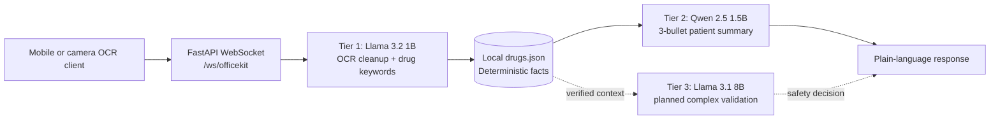

# 🏥 CircuitHealth AI: Multi-SLM Offline Patient Companion

CircuitHealth AI is an offline-first, low-latency patient and hospital companion backend. It combines local small language models (SLMs) with a deterministic clinical knowledge base so model output is grounded in verified local facts instead of open-ended medical improvisation.

> **Medical safety notice:** This project is an engineering prototype and decision-support aid, not a medical device or substitute for a licensed clinician. Always verify prescriptions, doses, allergies, and emergency symptoms with a qualified healthcare professional.

## Architecture

The current laptop backend implements the Tier 1 -> local RAG -> Tier 2 path over FastAPI WebSockets. Tier 3 validation and the mobile/hospital bridge are target architecture surfaces for subsequent releases.



### Request flow

1. A client sends prescription OCR text to `/ws/officekit`.
2. Llama 3.2 1B cleans OCR formatting and extracts likely drug names and dosages.
3. The backend matches drug names against the local `drugs.json` database.
4. Qwen 2.5 1.5B produces a concise, patient-friendly summary using the verified facts.
5. A future Tier 3 validator can inspect multi-drug interactions and complex safety cases.

## Features

- **3-Tier SLM cascading pipeline:** fast parsing, grounded summarization, and planned deep validation.
- **Deterministic zero-hallucination local RAG:** known drug facts are retrieved directly from a versioned local database.
- **Native multilingual voice and speech direction:** designed for English, Telugu, and Hindi model and client integrations.
- **Visual safety UX targets:** safety badges, drug matching, and scan blur detection for the companion client.
- **Hospital bridge roadmap:** TPA tracker, live billing meter, generic medicine swaps, and smart alarms.
- **Offline-first operation:** local Ollama inference and local clinical data avoid cloud dependency during normal use.

## Hardware and technology

| Layer | Current or target technology |
| --- | --- |
| Host server | ASUS Vivobook 16 with NVIDIA RTX 4050 |
| API | Python, FastAPI, Uvicorn, WebSockets |
| Local inference | Ollama |
| Tier 1 | Meta Llama 3.2 1B |
| Tier 2 | Qwen 2.5 1.5B |
| Tier 3 target | Meta Llama 3.1 8B |
| Clinical facts | Versioned JSON database (`drugs.json`) |
| Mobile target | iQOO 15, Snapdragon 8 Elite NPU |
| Mobile storage target | Quantized GGUF models, llama.cpp, Android SQLite FTS5 |

## Quickstart

### Prerequisites

- Windows 10/11
- Python 3.10 or newer
- [Ollama](https://ollama.com/) installed and running locally
- Sufficient disk and memory for the selected local models

### 1. Pull local models

Run these commands in PowerShell after installing Ollama:

```powershell
ollama pull llama3.2:1b
ollama pull qwen2.5:1.5b
ollama pull llama3.1:8b
```

The current backend calls the first two models. Pull the Tier 3 model now to prepare for the validator implementation.

### 2. Create and activate a virtual environment

```powershell
python -m venv venv
Set-ExecutionPolicy -Scope Process -ExecutionPolicy RemoteSigned
.\venv\Scripts\Activate.ps1
python -m pip install --upgrade pip
pip install -r requirements.txt
```

### 3. Start the backend

The convenience script activates the environment, starts Uvicorn on port 8000, and runs the WebSocket test client:

```powershell
.\start_server.bat
```

For development without the test client:

```powershell
.\venv\Scripts\Activate.ps1
uvicorn server:app --reload --host 0.0.0.0 --port 8000
```

Check the health endpoint at `http://localhost:8000/`. The WebSocket endpoint is `ws://localhost:8000/ws/officekit`.

### 4. Test the bridge

With the server running in another terminal:

```powershell
python test_client.py
```

The test sends an Amoxicillin prescription payload and prints the local model response.

## Repository layout

```text
.
├── drugs.json          # Local deterministic clinical facts
├── server.py           # FastAPI app, Ollama calls, WebSocket bridge
├── test_client.py      # Minimal WebSocket smoke client
├── start_server.bat    # Windows development launcher
├── requirements.txt    # Python dependencies
├── LICENSE             # MIT license
└── README.md
```

## Development notes

- Keep clinical facts explicit, reviewable, and versioned. Do not rely on model memory for dosage or safety claims.
- Treat OCR and model output as untrusted input and validate it before displaying patient guidance.
- Do not expose the Ollama API or this development server directly to the public internet without authentication, TLS, rate limiting, and audit logging.
- The sample database is intentionally small and is not a complete formulary.

## License

CircuitHealth AI is released under the [MIT License](LICENSE). Copyright (c) 2026 CircuitHealth AI contributors.
